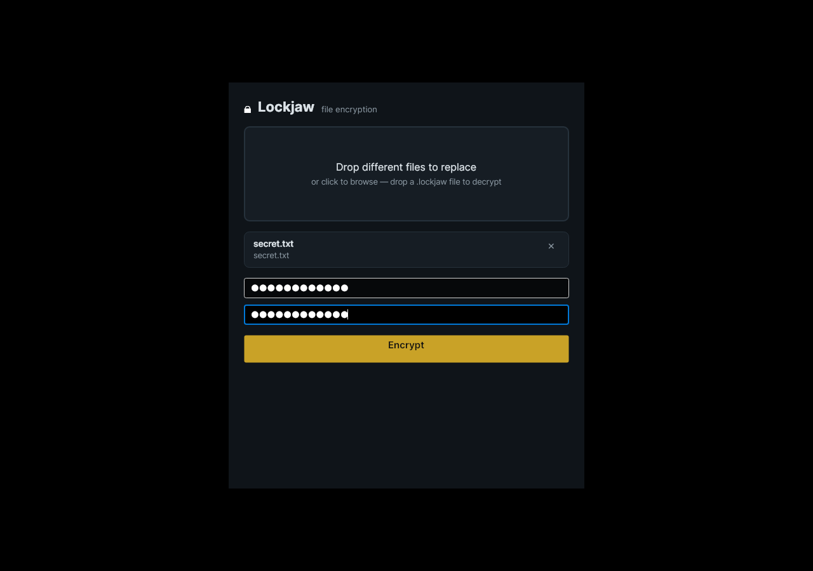

# Lockjaw

**Free, open-source file encryption for Windows.**

**Website:** [lockjaw.best](https://lockjaw.best) · **License:** MIT · **Crypto:** libsodium (XChaCha20-Poly1305 + Argon2id)

Lockjaw encrypts files and folders into a single `.lockjaw` container using
modern, well-studied cryptography. It runs completely offline — no accounts,
no cloud, no telemetry, no network code at all.



> **Security status:** development prototype. The design uses libsodium rather
> than custom cryptography, but this application and its container format have
> not received an independent security audit. Do not rely on it as the only
> protection for irreplaceable data yet. See [SECURITY.md](SECURITY.md) for the
> full list of release gates.

## Download

Grab the latest Windows build from the
[Releases page](https://github.com/kevinbdill/lockjaw/releases/latest).
It is a single self-contained `Lockjaw.exe` — nothing to install, no .NET
runtime required. Verify the SHA-256 published in the release notes.

Because the executable is not yet code-signed, Windows SmartScreen shows an
"unknown publisher" warning on first run: click **More info → Run anyway**.

## Quick start (GUI)

1. Double-click `Lockjaw.exe`.
2. **Drag files or folders** onto the window (drag-and-drop supports folders;
   the browse dialog currently selects files only).
3. Enter a passphrase twice and click **Encrypt** — a `.lockjaw` file appears
   next to your originals.
4. To decrypt, drop a `.lockjaw` file onto the window (the app switches to
   decrypt mode automatically), enter the passphrase, click **Decrypt**.

Folders are preserved exactly: subdirectories, file names, and timestamps all
travel inside the encrypted container and are invisible to anyone without the
passphrase. Multiple files and folders dropped together become one container.

A wrong passphrase or a tampered file produces one clean error and **no
partial output** — Lockjaw never writes plaintext it could not fully
authenticate.

## Quick start (CLI)

The same core is scriptable from the command line:

```text
Lockjaw encrypt <paths...> [-o out.lockjaw] [-p] [--armor] [--no-compress]
Lockjaw decrypt <file.lockjaw> [-o outdir] [-p]
Lockjaw inspect <file.lockjaw>
```

```powershell
Lockjaw encrypt .\QuarterlyReports -p
Lockjaw encrypt .\report.pdf -o report-email.lockjaw.txt -p --armor
Lockjaw decrypt .\QuarterlyReports.lockjaw -o .\Recovered -p
Lockjaw inspect .\QuarterlyReports.lockjaw
```

`--armor` produces a Base64 text container (`.lockjaw.txt`) that survives
email systems that block binary attachments. `inspect` prints the container
header (version, mode, KDF parameters) without requiring a passphrase.

Automation can set the `LOCKJAW_PASSPHRASE` environment variable, but
environment variables are less safe than the interactive prompt because other
process-management and logging tools may expose them.

Exit codes: `0` success · `1` wrong passphrase **or** damaged file
(deliberately indistinguishable) · `2` malformed/unsupported container ·
`3` I/O error.

See the **[User Guide](docs/USER_GUIDE.md)** for complete usage documentation.

## How it works

```
files/folders → PAX tar archive → DEFLATE compress → XChaCha20-Poly1305
                                                      secretstream (1 MiB
                                                      authenticated chunks)
```

- **Cipher:** XChaCha20-Poly1305 via libsodium `secretstream` — authenticated
  encryption with truncation detection (mandatory final tag).
- **Key derivation:** Argon2id13, 256 MiB memory / 3 operations by default;
  parameters are stored in the header so future defaults can change without
  breaking old files.
- **Header authentication:** the complete public header is fed as associated
  data to every chunk — tampering with any header field fails authentication.
- **Compression before encryption** (encrypted data is incompressible).
- **One cipher, one format version** — no algorithm menus to misconfigure.
- **Atomic output:** encryption and extraction stage to temporary siblings and
  rename only after full success. Existing outputs are never overwritten.
- **Safe extraction:** absolute paths, `..`, symlinks, and reparse points in
  archives are rejected.

Container details: [docs/FORMAT.md](docs/FORMAT.md). Full design spec:
[docs/SPEC.md](docs/SPEC.md).

## Building from source

Requires the .NET 8 SDK. Builds on Windows or Linux (the Windows exe
cross-compiles fine from Linux).

```bash
dotnet restore
dotnet test -c Release          # 6 unit tests must pass

# Windows GUI (single-file exe):
dotnet publish src/LockjawApp -c Release -r win-x64 --self-contained \
  -p:PublishSingleFile=true -p:IncludeNativeLibrariesForSelfExtract=true \
  -p:EnableCompressionInSingleFile=true

# Windows CLI:
dotnet publish src/LockjawCli -c Release -r win-x64 --self-contained \
  -p:PublishSingleFile=true -p:IncludeNativeLibrariesForSelfExtract=true \
  -p:EnableCompressionInSingleFile=true
```

Full developer documentation — project layout, test strategy, release
checklist, cross-compiling notes — is in **[docs/BUILDING.md](docs/BUILDING.md)**.
Contribution guidelines: **[CONTRIBUTING.md](CONTRIBUTING.md)**.

## Project structure

```
src/LockjawCore/   encryption engine — container format, streaming crypto,
                   tar archiving, safe extraction (no UI dependencies)
src/LockjawApp/    Windows GUI (Avalonia) — drag-drop encrypt/decrypt window
src/LockjawCli/    command-line interface
tests/             xUnit test suite for the core engine
docs/              format spec, design spec, user & developer guides
compliance/        US export-control (BIS) notification template
test-vectors/      compatibility-vector policy for frozen format versions
```

## Roadmap

- **Done:** core engine + CLI (v0.1), drag-and-drop GUI (v0.2)
- **Next:** folder picker in the browse dialog, recipient/public-key mode
  (encrypt to someone without a shared passphrase), Explorer shell
  integration, code signing (removes the SmartScreen warning)

## Documents

- [User Guide](docs/USER_GUIDE.md) — complete GUI and CLI usage
- [Building & Development](docs/BUILDING.md) — developer setup and release process
- [Container format](docs/FORMAT.md)
- [Design spec](docs/SPEC.md) and [M1 design review](docs/SPEC_REVIEW.md)
- [Security policy and release gates](SECURITY.md)
- [Compatibility-vector policy](test-vectors/README.md)
- [Changelog](CHANGELOG.md)

## License

MIT — see [LICENSE](LICENSE). Export-control and jurisdictional obligations
must be reviewed against the actual distribution method and public repository
before release; nothing in this repository is legal advice.
